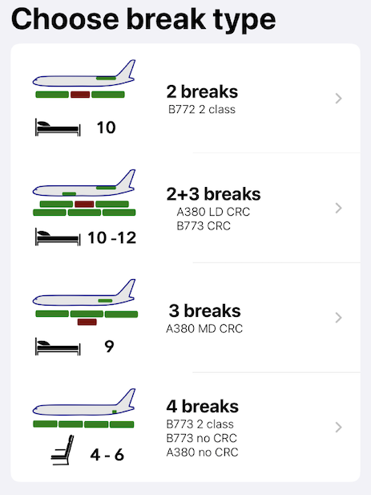

# Crew breaks app

## Types of breaks

Calculating crew break time sounds like trivial task: difference between end time and start time divide by number of breaks. However, it gets more complicated as you may have another service in between of breaks (ULR 2 class), may have middle service during second break (A380 MD CRC), or the "boss of them all" 3 class aircraft, where Fg1 have 3 breaks, other grades have 2 breaks and service in the middle and all of them need to have same break duration. Top it up with fact that Fg1 can start/end break before/after other grades (below its called extension). And “voila”! Now you have a real optimization task with multiple variables.

Here are diagrams of possible break layouts:

Pay attention how in certain cases breaks have **gaps** between them. This happened because certain grade (fg1 or co-grades) potentially can have more time for breaks (longer breaks), but due to equality rule, they got same duration as all other grades and gaps left over around their break times.

## Factors to consider

* Probably, the key requirement is that all crew have same break duration.
* Duty may be "crossing" calendar dates, if flight goes over night. In this case break may start at 21:00 and end next day at 3:00.

## Visuals

I'm really proud cause I created my **own SVGs** for the project including app icon. I depicted location of crew rest compartment on aircraft model and diagram of the breaks pattern for user clarity. Here are examples:

And here is the quick look on app's functionality:

## How to install

Best way is to add the app to AppStore. However, it will require Apple developer account, which currently cost 99$. More information [here](https://developer.apple.com/ios/submit/ "How to add App to AppStore").

If just want to play with it yourself, then do the following (XCode will be required):

1. Enable "Developer mode" on your device: Settings > Privacy > Developer mode. Restart device. Now you can install side apps on your iPhone.
2. Log in in XCode with your Apple ID.
3. Connect your device to iPhone via cable.
4. On top bar in XCode (where the project/app name is) select your device.
5. Press "Play" button on top bar. The app will be loaded on your iPhone.
6. To run the app you need to accept developer's certificate: Settings > General > VPN and device management > Select your certificate.

Done! Now you can run the app just as any other app on your iPhone.

## Changelog
